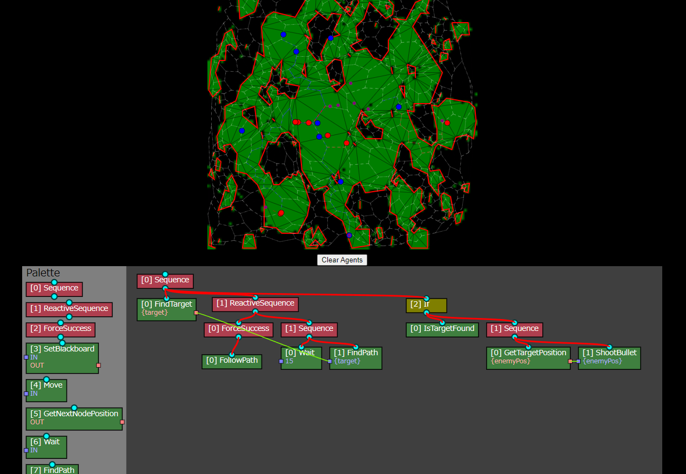

# Swarm-js
Swarm JS

Try it now with your browser!

https://msakuta.github.io/swarm-js/

## Overview

This is an experimental repository to demonstrate many agents (swarm) work in a single simulation.

It exibits a basic behavior tree implementation.
You can drag the nodes and connectors to modify the behavior online.

## Libraries

This project uses following external libraries:

* [Konva.js](https://konvajs.org/)
* [MarchingSquares.js](https://github.com/RaumZeit/MarchingSquares.js/tree/master)
* [simplify.js](http://mourner.github.io/simplify-js/)
* [Delaunator](https://github.com/mapbox/delaunator)